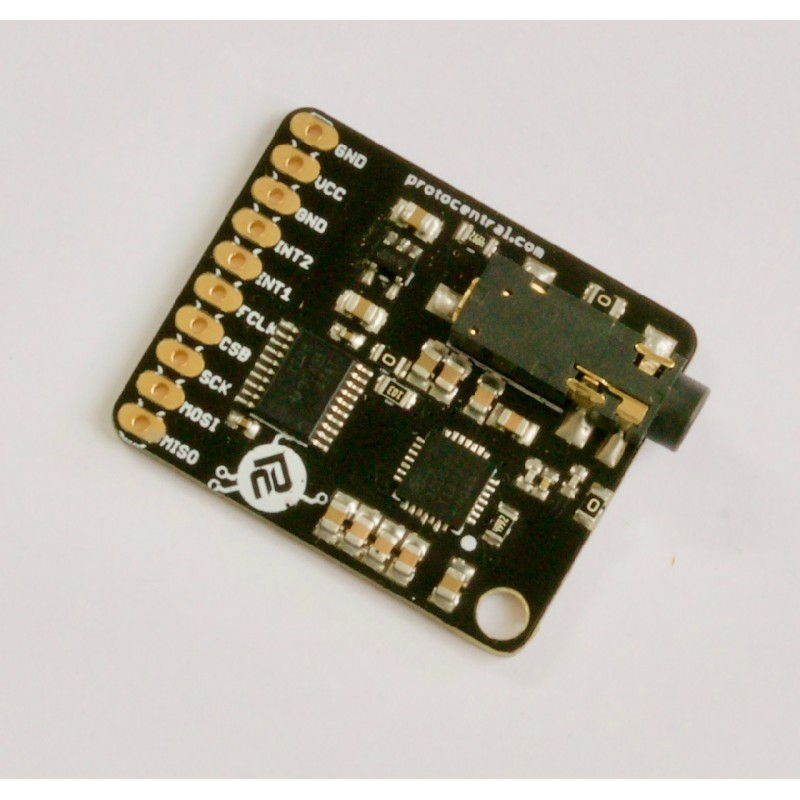

ProtoCentral MAX30003 Single-Channel ECG Breakout Board
=======================================================

If you dont already have one, you can buy [ProtoCentral MAX30003 breakout here.](https://www.protocentral.com/healthypi)

MAX30003 is a single-lead ECG monitoring IC which has built-in R-R detection and several other features that make it perfect for a wearable single-lead ECG application.  

Several new features on this chip make it ideal for wearable applications. First is the low power consumption - just 85 uW of power and can work from 1.1 V onwards ! Also of interest is the fact that it can work with only two chest electrodes without the need for a third right-leg drive (DRL) electrode. 

The best feature of this chip though is the built-in R-R detection algorithm which can measure the time between successive peaks of the QRS complex of the ECG. This means that heart-computation comes right out of the box without any microcontroller-side code requirement. Heart-rate computation just got a lot easier !!

Features:
---------

* MAX30003 IC on-board
* Single-lead ECG monitoring
* R-R peak detection for heart rate computation
* High DC Offset range
* Heart Rate computation using Pan-Tompkins algorithm
* On-board level translator for 5V-tolerant operation
* On-board low-noise 3.3V voltage regulator

What's included:
----------------

* ProtoCentral MAX30003 Breakout board
* Straight pin headers
* 2-electrode ECG connector with stereo connector
* 10x disposable ECG stick-on electrodes 

Repository Contents
-------------------
* **/software** - Arduino library and example sketches.
* **/hardware** - All Eagle hardware design files 
* **/docs** - additional documentation

 
Wiring the Breakout to your Arduino
------------------------------------
If you have bought the breakout the connection with the Arduino board is as follows:
 
|MAX30003 pin label| Arduino Connection   |Pin Function      |
|----------------- |:--------------------:|-----------------:|
| MISO             | D12                  |  Slave out|             
| MOSI       | D11                   |  Slave in           |
| SCK            | D13                   |  Serial clock     |
| CS0             | D7                   |  Slave select|
| FCLK               | D6                   |  External clock(32KHz)     |
| INT1             | NC                  |  Interrupt        |
| INT2             | NC                  |  Interrupt       |
| 3V3              | Supply                 |  Board which supports 3.3V    |
| VCC              | Supply 5V                  | 5V            |
| GND                             | Gnd  
 
Using the GUI
-------------

Connecting the ECG Electrodes
------------------------------
 A 3-electrode cable along with a standard stereo jack is provided along with the shield to connect the electrodes to the     shield. The electrode input connector is highlighted in the below picture.
 
 
 
 The other side of the electrode connector would connect to snap-on electrodes attached to the body. For testing purposes,    you can use an ECG simulator to provide inputs to the board. 

 Warning:
 When connecting the electodes to the body, it is safer to disconnect the mains power source to the Arduino. For example, if  you are using the Arduino along with a laptop, disconnecting the battery charger from the laptop would be a safe option.
 
Placing the Electrodes on the body
---------------------------------

License Information
===================

This product is open source! Both, our hardware and software are open source and licensed under the following licenses:

Hardware
---------

**All hardware is released under [Creative Commons Share-alike 4.0 International](http://creativecommons.org/licenses/by-sa/4.0/).**

Software
--------

**All software is released under the MIT License(http://opensource.org/licenses/MIT).**

Please check [*LICENSE.md*](LICENSE.md) for detailed license descriptions.
