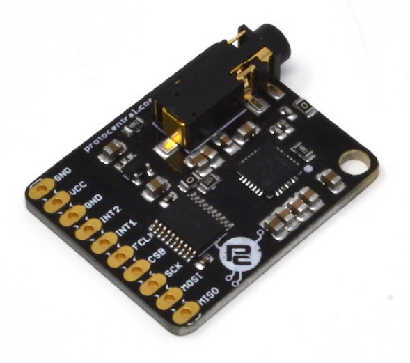
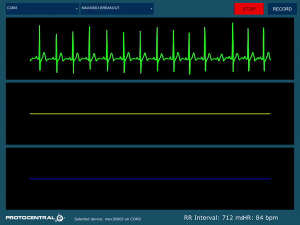
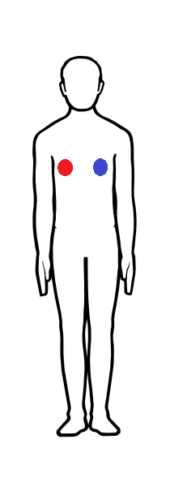

# ProtoCentral MAX30003 Single-lead ECG Breakout Board

If you dont already have one, you can buy [ProtoCentral MAX30003 breakout here.](https://www.protocentral.com/open-medical-devices/1149-protocentral-max30003-single-lead-ecg-breakout-board.html)

MAX30003 is a single-lead ECG monitoring IC which has built-in R-R detection and several other features that make it perfect for a wearable single-lead ECG application.  

Several new features on this chip make it ideal for wearable applications. First is the low power consumption - just 85 uW of power and can work from 1.1 V onwards ! Also of interest is the fact that it can work with only two chest electrodes without the need for a third right-leg drive (DRL) electrode.

The best feature of this chip though is the built-in R-R detection algorithm which can measure the time between successive peaks of the QRS complex of the ECG. This means that heart-computation comes right out of the box without any microcontroller-side code requirement. Heart-rate computation just got a lot easier !!

# Features

* MAX30003 IC on-board
* Single-lead ECG monitoring
* R-R peak detection for heart rate computation
* High DC Offset range
* Heart Rate computation using Pan-Tompkins algorithm
* On-board level translator for 5V-tolerant operation
* On-board low-noise 1.8V and 3.3V voltage regulator

# What's included

* ProtoCentral MAX30003 Breakout board
* Straight pin headers
* 2-electrode ECG connector with stereo connector
* 10x disposable ECG stick-on electrodes

# Repository Contents

* **/software** - Arduino library and example sketches.
* **/hardware** - All Eagle hardware design files

# Wiring the board to your Arduino

If you have bought the breakout the connection with the Arduino board is as follows:

|MAX30003 pin label| Arduino Connection   |Pin Function      |
|----------------- |:--------------------:|-----------------:|
| MISO             | D12                  |  Slave out|             
| MOSI             | D11                  |  Slave in           |
| SCK              | D13                  |  Serial clock     |
| CS0              | D7                   |  Slave select|
| FCLK             | NC                   |  External clock(32KHz)     |
| INT1             | NC                   |  Interrupt        |
| INT2             | NC                   |  Interrupt       |
| 3V3              | Supply               |  Board which supports 3.3V and 1.8V    |
| VCC              | Supply 5V            | 5V            |
| GND              | Gnd  

# Running the Arduino Sketch

If you have correctly installed the libraries, the example sketeches should now be available from within Arduino.

[Download the Arduino Sketch here for this board here.](https://github.com/Protocentral/protocentral_max30003/releases/download/v0.1/protocentral_max30003_arduino.zip)

Open up your Arduino IDE and run the Arudino sketch (.ino) file in the archive that you downloaded. Your Arduino should now be programmed to read the ecg data and sending over the USB-UART.  

# Using the ProtoCentral OpenView GUI

The GUI for visualizing the ECG and Respiration as well as parameters like Heart rate and Respiration rate is written in Processing, based on Java and is cross-compilable across platforms.

Java 8 is required on all platforms for running the processing-based GUI application. You can download Java for your platform from the [Official Java website](https://www.java.com/en/download/).

You can download and install [ProtoCentral OpenView from here](https://github.com/Protocentral/protocentral_openview).

Once you have opened OpenView, make sure to select "MAX30003 breakout" under the "Board" dropdown. 

# Connecting the ECG Electrodes

A 2-electrode cable along with a standard stereo jack is provided along with the shield to connect the electrodes to the board. The electrode input connector is highlighted in the below picture.

The other side of the electrode connector would connect to snap-on electrodes attached to the body. For testing purposes, you can use an ECG simulator to provide inputs to the board.

*Warning:
When connecting the electodes to the body, it is safer to disconnect the mains power source to the Arduino. For example, if  you are using the Arduino along with a laptop, disconnecting the battery charger from the laptop would be a safe option.*

# Placing the Electrodes on the body

License Information
===================

This product is open source! Both, our hardware and software are open source and licensed under the following licenses:

Hardware
---------

**All hardware is released under [Creative Commons Share-alike 4.0 International](http://creativecommons.org/licenses/by-sa/4.0/).**

You are free to:

* Share — copy and redistribute the material in any medium or format
* Adapt — remix, transform, and build upon the material for any purpose, even commercially.
The licensor cannot revoke these freedoms as long as you follow the license terms.

Under the following terms:

* Attribution — You must give appropriate credit, provide a link to the license, and indicate if changes were made. You may do so in any reasonable manner, but not in any way that suggests the licensor endorses you or your use.
* ShareAlike — If you remix, transform, or build upon the material, you must distribute your contributions under the same license as the original.

Software
--------

**All software is released under the MIT License(http://opensource.org/licenses/MIT).**

THE SOFTWARE IS PROVIDED "AS IS", WITHOUT WARRANTY OF ANY KIND, EXPRESS OR IMPLIED, INCLUDING BUT NOT LIMITED TO THE WARRANTIES OF MERCHANTABILITY, FITNESS FOR A PARTICULAR PURPOSE AND NONINFRINGEMENT. IN NO EVENT SHALL THE AUTHORS OR COPYRIGHT HOLDERS BE LIABLE FOR ANY CLAIM, DAMAGES OR OTHER LIABILITY, WHETHER IN AN ACTION OF CONTRACT, TORT OR OTHERWISE, ARISING FROM, OUT OF OR IN CONNECTION WITH THE SOFTWARE OR THE USE OR OTHER DEALINGS IN THE SOFTWARE.

Please check [*LICENSE.md*](LICENSE.md) for detailed license descriptions.
