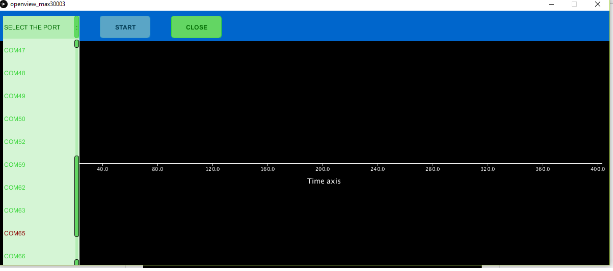
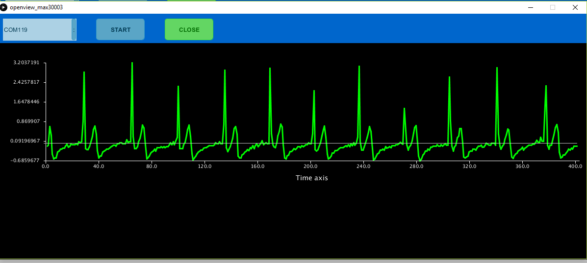

ProtoCentral MAX30003 Single-Channel ECG Breakout Board
=======================================================

If you dont already have one, you can buy [ProtoCentral MAX30003 breakout here.](https://www.protocentral.com/healthypi)

MAX30003 is a single-lead ECG monitoring IC which has built-in R-R detection and several other features that make it perfect for a wearable single-lead ECG application.  

Several new features on this chip make it ideal for wearable applications. First is the low power consumption - just 85 uW of power and can work from 1.1 V onwards ! Also of interest is the fact that it can work with only two chest electrodes without the need for a third right-leg drive (DRL) electrode. 

The best feature of this chip though is the built-in R-R detection algorithm which can measure the time between successive peaks of the QRS complex of the ECG. This means that heart-computation comes right out of the box without any microcontroller-side code requirement. Heart-rate computation just got a lot easier !!

Features:
---------

* MAX30003 IC on-board
* Single-lead ECG monitoring
* R-R peak detection for heart rate computation
* High DC Offset range
* Heart Rate computation using Pan-Tompkins algorithm
* On-board level translator for 5V-tolerant operation
* On-board low-noise 3.3V voltage regulator

What's included:
----------------

* ProtoCentral MAX30003 Breakout board
* Straight pin headers
* 2-electrode ECG connector with stereo connector
* 10x disposable ECG stick-on electrodes 

Repository Contents
-------------------
* **/software** - Arduino library and example sketches.
* **/hardware** - All Eagle hardware design files 
* **/docs** - additional documentation

 
Wiring the Breakout to your Arduino
------------------------------------
If you have bought the breakout the connection with the Arduino board is as follows:
 
|MAX30003 pin label| Arduino Connection   |Pin Function      |
|----------------- |:--------------------:|-----------------:|
| MISO             | D12                  |  Slave out|             
| MOSI       | D11                   |  Slave in           |
| SCK            | D13                   |  Serial clock     |
| CS0             | D7                   |  Slave select|
| FCLK               | D6                   |  External clock(32KHz)     |
| INT1             | NC                  |  Interrupt        |
| INT2             | NC                  |  Interrupt       |
| 3V3              | Supply                 |  Board which supports 3.3V    |
| VCC              | Supply 5V                  | 5V            |
| GND                             | Gnd  
 

Installing the Arduino libraries 
---------------------------------
 The Arduino library contains the functions required to communicate with the breakout. Please follow   the following steps to get the  library downloaded and working:
 Download the library ZIP file from the following link:

 https://github.com/Protocentral/MAX30003/tree/master

 Unzip the ZIP file and it should result in a folder called "MAX30003". Copy this folder into your Arduino IDE’s libraries folder. Depending on your operating system, this could be either within your Arduino IDE’s foldesualizing r or in  your documents folder. For more information, please check http://arduino.cc/en/Guide/Libraries
 
Running the Example sketch
--------------------------
 If you have correctly installed the libraries, the example sketeches should now be available from within Arduino. Open up    your Arduino IDE and select ads1292r>examples>ads_1292r_breakout_brainbay to open the ECG displaying example for visualization use brainbay freeware(explained below), and  ads1292r>example>Xively_writeYUN7_BPMfiltered_avg to open the   Xively iot HR display example. 

This sketch is designed to read the data from the electrodes in real-time and stream them thorugh the UART to a receiving software. 

Using Processing - Data Visualisation Software (New!)
-----------------------------------------------------
 Processing is a data visualisation software, in existence since 2001, used by artists and scientists alike. Its an open source coding framework based on Java. If you are familiar with the Arduino environment, the Processing IDE is similar and you wont have much of a learning curve to climb!
 
 The following are the steps to run the code:

### 1.Download Processing for your operating system

 Download the processing ide latest version from the link

* [MAC] (http://download.processing.org/processing-3.1.1-macosx.zip)
* [Linux 32-bit] (http://download.processing.org/processing-3.1.1-linux32.tgz)
* [Linux 64-bit] (http://download.processing.org/processing-3.1.1-linux64.tgz)
* [Windows 32-bit] (https://processing.org/download/?processing)
* [Windows 64-bit] (https://processing.org/download/?processing)

 Once downloaded, unzip the archive and install the app as per your OS.

### 2. Download the Processing code for ECG visualisation

 a. Download the necessary files & directories or clone to your desktop from github.

 b. Unzipping the archive should make a folder by name ads1292r_shield that contains the visualisation code.

 c. Locate the Processing sketchbook directory on your computer. This should have been created automatically when you installed processing. Depending on your operating system, the path will be as follows:

* On Windows: c:/My Documents/Processing/
* On MAC: /Users/your_user_name/Documents/Processing/
* On Linux: /Home/your_user_name/sketchbook/

**Note:** This directory appears as "Processing" on Windows/Mac, and goes by the name "Sketchbook" on Linux. Create a subdirectory by name "libraries if one doesn't exist already.

 d. From the above mentioned "ads1292r_shield" directory Copy/Move the contents of the ADS1292rShield_Breakout/Processing/ces_view_ecg folder to the Processing sketchbook directory which is also mentioned above (Locate the Processing sketchbook)

 e. Finally, copy the controlP5 and G4P directories from ADS1292rShield_Breakout\Processing\libraries and paste them into the libraries directory of your Processing sketchbook.

 f. You are all set now to get your first ECG reading visualised from the ADS1292R shield!

### 3. Open Processing & launch the ces_view_ecg

 a. If Processing IDE was open, close it and reopen to refresh the libraries and sketches. The repositories are not refreshed if the IDE was open while the Sketches and Libraries were being updated.

 b. Double-click any of the .pde files in the ces_view_ecg directory to open all of the ecg code in the Processing IDE.

 c. If everything done so far was good, clicking the "run" button on the top left corner of the IDE, should run the code! If it does not, make sure you installed your libraries correctly.

 d. Once the GUI is running, select the port connect with ECG from the "SELECT PORT" dropdown as shown in the figure below

 e. Once the port selection is appropriate the START button gets enabled. Click "START" to initiate visualisation

 f. You should see the ECG wave generated with the values obtained from the ADS1292rShield Breakout Board as shown below.

Connecting the ECG Electrodes
------------------------------
 A 3-electrode cable along with a standard stereo jack is provided along with the shield to connect the electrodes to the     shield. The electrode input connector is highlighted in the below picture.
 
 The other side of the electrode connector would connect to snap-on electrodes attached to the body. For testing purposes,    you can use an ECG simulator to provide inputs to the board. 

 Warning:
 When connecting the electodes to the body, it is safer to disconnect the mains power source to the Arduino. For example, if  you are using the Arduino along with a laptop, disconnecting the battery charger from the laptop would be a safe option.
 
Placing the Electrodes on the body
---------------------------------

License Information
===================

This product is open source! Both, our hardware and software are open source and licensed under the following licenses:

Hardware
---------

**All hardware is released under [Creative Commons Share-alike 4.0 International](http://creativecommons.org/licenses/by-sa/4.0/).**

Software
--------

**All software is released under the MIT License(http://opensource.org/licenses/MIT).**

Please check [*LICENSE.md*](LICENSE.md) for detailed license descriptions.
